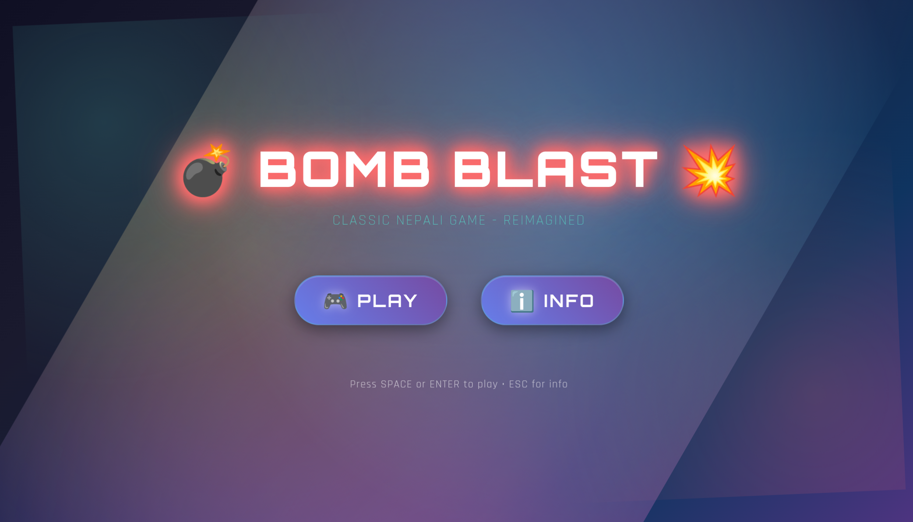
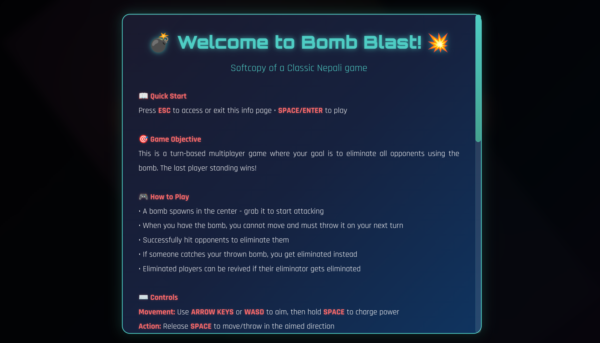
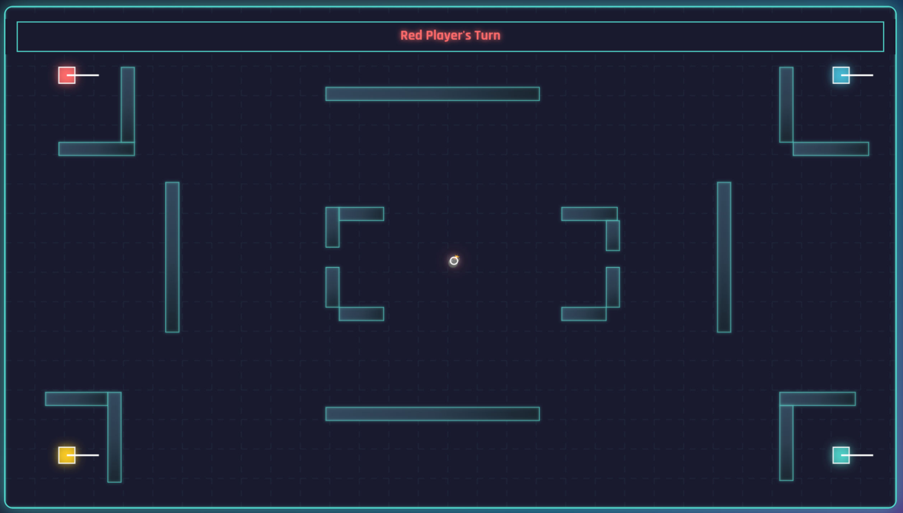

# 💣 Bomb Blast - Multiplayer Game 💥

## Description

**Bomb Blast** is a thrilling turn-based multiplayer browser game inspired by classic Nepali gaming traditions. Built with pure HTML5 Canvas and JavaScript, this game brings the excitement of strategic bomb throwing to your browser!

### 🎯 Game Features

- **Turn-based Strategy**: Players take turns moving and throwing the bomb
- **Multiple Game Modes**: 2-4 player support with solo and duo team modes
- **Strategic Aiming System**: Use numpad (1-8) to select attack directions
- **Defense Mechanics**: Catch thrown bombs by guessing the attack direction
- **Dynamic Physics**: Realistic collision detection and bouncing mechanics
- **Elimination & Revival**: Eliminated players can return if their eliminator gets taken out
- **Destructible Environment**: Bombs destroy walls and create strategic openings

### 🎮 How to Play

1. **Objective**: Be the last player (or team) standing
2. **Movement**: Use WASD or Arrow Keys to aim, hold Space to charge power
3. **Bomb Mechanics**: Move through the bomb to pick it up, then throw it at opponents
4. **Aiming**: When throwing, secretly select your target direction (1-8 on numpad)
5. **Defense**: If hit, choose 3 directions to attempt catching the bomb
6. **Victory**: Successfully catch a bomb to eliminate the thrower and steal it!

### 🚀 Quick Start

**Just Open the HTML File! It's a static game!**

Simply open `Bomb blast.html` in any modern web browser and start playing!

### 📸 Screenshots

---

*Relive the classic Nepali gaming experience with modern web technology!*
